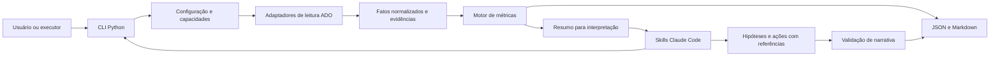

# Arquitetura do ado-team-compass — v1.0

Data: 12/09/2026 · Complexidade: L · Planejamento standalone · Estado: proposta de implementação, sem código criado.

## 1. Contexto

Construir uma ferramenta distribuível de visibilidade de entrega baseada no Azure DevOps, adaptável às práticas de cada equipe, com cálculo reproduzível e interpretação apoiada em evidências. Claude Code é a primeira integração, conforme a proposta original; a arquitetura não depende dele para coletar, calcular ou emitir relatórios básicos.

A pasta de trabalho foi inspecionada: contém apenas `work/` e `outputs/`, sem aplicação, testes, Git, AGENTS.md local ou memory-bank anterior. Todos os caminhos de produto deste planejamento são **novos e propostos**, não componentes encontrados em um repositório existente.

Restrições: nenhuma inferência de ociosidade real, nenhum ranking de produtividade individual, nenhuma soma de unidades incompatíveis, nenhuma credencial em artefatos, nenhuma alteração no Azure DevOps na primeira versão. Dados incompletos precisam permanecer identificáveis até a saída.

## 2. Decisões arquiteturais

### D01 — Núcleo Python e integração fina com o assistente

| Opção | Benefício | Custo ou limitação |
|---|---|---|
| Skills chamando MCP para tudo | Protótipo rápido | Coleta e cálculo dependem do ambiente do assistente |
| Pacote Python com CLI e skills consumidoras | Testes, execução em pipeline e reuso | Exige empacotamento e instalação do runtime |
| Serviço hospedado central | Agendamento e acesso centralizados | Infraestrutura, autenticação e operação adicionais |

**Decisão:** pacote Python com CLI. Funções de domínio recebem entradas normalizadas, configuração resolvida e relógio explícito. Nenhuma função de cálculo acessa rede, relógio do sistema ou LLM. O pacote entrega JSON e Markdown sem LLM; o assistente acrescenta interpretação estruturada.

Premissa: execução local atende ao primeiro lançamento. Risco: instalação pesada; mitigação: ambiente isolado, instalador multiplataforma, artefato com versão fixa e diagnóstico de dependências. Serviço hospedado fica adiado.

### D02 — REST para coleta principal; Analytics como capacidade adicional

| Opção | Benefício | Custo ou limitação |
|---|---|---|
| Apenas MCP | Interface exploratória conveniente | Catálogo e autenticação do cliente tornam-se dependências do relatório |
| REST + Analytics opcionais | Controle de paginação, histórico e evidência | Dois adaptadores e testes de consistência temporal |
| Apenas Analytics | Modelo analítico conveniente | Não substitui todos os dados operacionais de equipe e capacidade |

**Decisão:** REST para configuração e situação atual; Analytics para séries e revisões quando disponível. MCP será integração opcional posterior, sem participar do caminho crítico. Não instalar um servidor MCP automaticamente na v0.1.

Separar `AdoReadClient`, descoberta, coleta atual e coleta histórica. Consultas lógicas de leitura podem usar HTTP POST, como WIQL e leitura em lote: controle de segurança por operação permitida, não apenas por verbo HTTP.

Risco: histórico inacessível; mitigação: marcar a capacidade como indisponível sem impedir o relatório atual. REST e Analytics terão metadados próprios de coleta; não declarar transação atômica entre fontes.

### D03 — Configuração por perfis e capacidades disponíveis

| Opção | Benefício | Custo ou limitação |
|---|---|---|
| Um modelo fixo de Scrum e horas | Menor implementação | Exclui Kanban e práticas legítimas |
| Perfis com capacidades habilitadas | Adapta sem código específico por equipe | Exige validação e precedência de configuração |
| Linguagem arbitrária de regras | Flexibilidade máxima | Difícil suporte, segurança e testabilidade |

**Decisão:** perfis declarativos tipados; sem execução de código em YAML. Capacidades: situação atual, carga, compromisso, fluxo histórico, planejamento, forecast. Cada uma declara requisitos, evidência de disponibilidade e razão de indisponibilidade.

Precedência: defaults do produto → perfil nomeado → configuração de equipe → opções da execução. A configuração efetiva, sem segredos, acompanha a execução. IDs estáveis para organização/projeto/equipe; nomes apenas para exibição e resolução inicial.

Premissa: um conjunto pequeno de perfis cobre a primeira versão. Risco: personalizações excessivas; mitigação: overrides validados e catálogo documentado, sem ramificações por nome de cliente.

### D04 — Disponibilidade pessoal distinta das reservas por equipe

| Opção | Benefício | Custo ou limitação |
|---|---|---|
| Somar capacidades dos times | Fácil | Pode fabricar disponibilidade |
| Disponibilidade pessoal + reservas + carga única | Expõe sobreposição e limites da evidência | Pode exigir informação adicional do usuário |

**Decisão:** calcular capacidade reservada por time e verificar contra disponibilidade pessoal informada quando existir. Sem disponibilidade validada, não emitir percentual global de utilização. Mostrar reservas, sobreposição, cargas observadas e limitação de cobertura.

Deduplicar work items por organização + ID. Mesma pessoa em organizações diferentes só será consolidada por mapeamento explícito; não deduzir identidade por nome ou e-mail. A v0.1 consolida equipes selecionadas de uma organização, inclusive projetos distintos; agregação entre organizações fica adiada.

Usar calendário por pessoa para visão global e por equipe para reservas. Janela comum com início inclusivo e término exclusivo. Não converter dias em horas sem fator explícito.

### D05 — Evidência e resumo separados

| Opção | Benefício | Custo ou limitação |
|---|---|---|
| Um JSON contendo tudo | Implementação inicial curta | Contexto crescente e acoplamento à sprint |
| Manifesto + fatos normalizados + métricas + resumo | Auditoria completa com contexto limitado | Mais contratos e integridade entre arquivos |
| Banco central | Consultas flexíveis | Operação e migrações fora da necessidade inicial |

**Decisão:** diretórios de execução imutáveis, sem banco na v0.1. `run.json` referencia fatos, métricas, evidências e resumo por hashes. O resumo identifica tudo que foi truncado; o assistente pode pedir detalhes ao leitor de evidências local.

`schema_version`, `engine_version`, `metric_definitions_version` e `config_hash` são separados. Reprodutibilidade significa mesmos fatos + configuração + relógio + versão produzirem mesmas métricas, não a mesma prosa do LLM.

Risco: perda de dados para auditoria; mitigação: retenção explícita e exportação controlada. O hash detecta alterações, mas não prova integridade contra um administrador que substitua também o manifesto.

### D06 — Relatórios determinísticos com interpretação delimitada

**Opções:** texto livre a partir de fatos; ou tabelas determinísticas e interpretação estruturada com referências.

**Decisão:** o núcleo produz tabelas e achados. A skill entrega fatos, hipóteses e ações em campos distintos. IDs e referências são validados contra a execução; totais e percentuais vêm do motor. Se a interpretação falhar na validação, manter o relatório determinístico e informar que a narrativa não foi incorporada.

Tratar títulos e descrições dos itens como conteúdo não confiável, nunca como instruções. Coletar somente campos necessários; não incluir comentários e descrições integrais por padrão. Os testes de narrativa verificam afirmações indevidas, e não igualdade literal de parágrafos.

### D07 — Distribuição por release independente e marketplace

**Opções:** copiar pasta manualmente; instalar pacote em ambiente isolado e plugin por marketplace; binários nativos para todos os sistemas.

**Decisão:** release com wheel Python, dependências bloqueadas, checksum, documentação e pacote Claude Code com skills. Instalador usa `uv` como opção principal e ambiente virtual Python como alternativa documentada. A versão do motor compatível fica fixada no pacote do plugin. Não depender de diretórios externos ao pacote em cache nem instalar dependências a cada relatório.

Um marketplace Git contém a entrada de instalação. A release candidata é testada em perfil limpo antes de ser promovida. URL e proprietário do repositório serão os do repositório real escolhido na publicação; não inventar endereço neste plano.

Risco: ambientes corporativos sem acesso ao registry; mitigação: bundle de dependências para instalação assistida/offline na etapa de distribuição. Binários nativos e segundo ambiente de assistente são evoluções separadas.

### D08 — Autenticação explícita e persistência mínima

**Decisão:** primeira opção interativa usa sessão Entra do Azure CLI por provedor explícito; fallback PAT somente por variável de ambiente quando permitido pela organização. Não reutilizar sessão do MCP nem tentar uma cadeia silenciosa de identidades. O diagnóstico informa identidade, tenant e organizações acessíveis, sem token.

Automação posterior usa provedor de identidade de aplicação apropriado ao executor e requer acesso concedido no ADO. A documentação da Microsoft distingue delegação de usuário e identidade de aplicação. [Autenticação Entra](https://learn.microsoft.com/en-us/azure/devops/integrate/get-started/authentication/entra?view=azure-devops).

Configuração compartilhável fica separada de cache, overrides pessoais e relatórios. Cache isolado por identidade e organização, sem compartilhamento implícito entre usuários. Sem telemetria externa por padrão. Retenção local inicial: 30 dias, configurável; purga nunca afeta a origem ADO.

## 3. Fluxo de arquitetura

## 4. Impacto nos artefatos

| Decisão | Plano | Tarefas |
|---|---|---|
| D01 | Contratos e estrutura do núcleo | T01, T02, T11, T13 |
| D02 | Coleta, cobertura e histórico | T03–T06, T17 |
| D03 | Setup, políticas e métricas disponíveis | T02, T04, T07, T19 |
| D04 | Calendários, carga e cobertura global | T08–T10 |
| D05 | Manifesto, retenção e reprodutibilidade | T02, T06, T11, T14 |
| D06 | Relatórios e critérios de narrativa | T12, T13 |
| D07 | Empacotamento e liberação | T01, T15, T16 |
| D08 | Autenticação, limites de acesso e automação | T03, T06, T23, T24 |

## 5. Decisões adiadas

| Tema | Motivo | Condição para retomar |
|---|---|---|
| Serviço hospedado e multi-tenant | Infraestrutura desnecessária para validar utilidade | Demanda concreta de acesso centralizado |
| Jira e outros conectores | Não solicitado para primeira versão | Contrato ADO consolidado e usuário real |
| Plugin para outro assistente | Primeira proposta é Claude Code | Release estável e teste do novo host |
| Escrita de atribuições/comentários no ADO | Mais permissões e risco operacional | Fluxo de revisão, idempotência e autorização definidos |
| Forecast avançado | Requer histórico e avaliação própria | T17–T21 concluídas |
| Licença e publicação pública | Decisão de distribuição externa | Repositório proprietário e licença definidos antes da promoção pública |

## 6. Metadados

Oito decisões; sem infraestrutura hospedada na v0.1; versão 1.0. Revisão do plano recomendada antes da implementação por se tratar de produto novo com múltiplos contratos. Nenhuma aprovação é necessária para concluir estes documentos; este trabalho não implementa nem publica o plugin.
