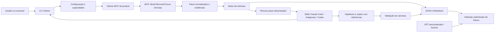

# Arquitetura do ado-team-compass — v1.3

Data: 12/09/2026 · Complexidade: L · Planejamento standalone · Estado: proposta de implementação, sem código criado.

## 1. Contexto

Construir uma ferramenta distribuível de visibilidade de entrega baseada no Azure DevOps, adaptável às práticas de cada equipe, com cálculo reproduzível e interpretação apoiada em evidências. Claude Code, Antigravity e Codex terão integrações locais na v0.1; GPT personalizado usará API autenticada na v0.3.1. O motor não depende do modelo de linguagem para coletar, calcular ou emitir relatórios básicos.

A pasta de trabalho foi inspecionada: contém apenas `work/` e `outputs/`, sem aplicação, testes, Git, AGENTS.md local ou memory-bank anterior. Todos os caminhos de produto deste planejamento são **novos e propostos**, não componentes encontrados em um repositório existente.

Restrições: nenhuma inferência de ociosidade real, nenhum ranking de produtividade individual, nenhuma soma de unidades incompatíveis, nenhuma credencial em artefatos, nenhuma alteração no Azure DevOps na primeira versão. Dados incompletos precisam permanecer identificáveis até a saída.

## 2. Decisões arquiteturais

### D01 — Núcleo Python e integração fina com o assistente

| Opção | Benefício | Custo ou limitação |
|---|---|---|
| Skills chamando MCP para tudo | Protótipo rápido | Coleta e cálculo dependem do ambiente do assistente |
| Pacote Python com CLI e skills consumidoras | Testes, execução em pipeline e reuso | Exige empacotamento e instalação do runtime |
| Serviço hospedado central | Agendamento e acesso centralizados | Infraestrutura, autenticação e operação adicionais |

**Decisão:** pacote Python com CLI. Funções de domínio recebem entradas normalizadas, configuração resolvida e relógio explícito. Nenhuma função de cálculo acessa rede, relógio do sistema ou LLM. O pacote entrega JSON e Markdown sem LLM; o assistente acrescenta interpretação estruturada.

Premissa: execução local atende ao primeiro lançamento. Risco: instalação pesada; mitigação: ambiente isolado, instalador multiplataforma, artefato com versão fixa e diagnóstico de dependências. O gateway remoto fica na v0.3.1 e não é dependência dos hosts locais.

### D02 — MCP oficial como único acesso ao Azure DevOps

**Decisão do usuário:** toda comunicação com o ADO passa exclusivamente pelo servidor oficial Microsoft Azure DevOps MCP. Referência: [repositório oficial](https://github.com/microsoft/azure-devops-mcp). Esta decisão substitui a proposta anterior de REST/Analytics direto.

O cliente do produto fala MCP com o servidor oficial remoto ou, quando necessário, com o pacote oficial local via stdio. O servidor pode usar REST internamente; o produto não duplica esse acesso. Não usar REST/OData direto, SDK ADO, Azure CLI para consultar ADO, scraping ou um servidor alternativo como fallback.

Separar cliente MCP, descoberta de catálogo, mapeamento de operações de leitura e normalização de respostas. O motor numérico recebe fatos estruturados e permanece independente do LLM. Registrar servidor/versão quando disponível, hash do catálogo, ferramenta/ação, argumentos sanitizados, paginação e evidências.

Validar ferramentas e schemas com o servidor conectado. Catálogos local e remoto podem diferir; não fixar nomes sem negociação/verificação. Controlar por ferramenta **e ação**, pois uma ferramenta pode incluir leitura e escrita. Operação não suportada gera capacidade indisponível; nunca dispara conexão direta.

Histórico vem de revisões/consultas expostas pelo MCP ou de snapshots locais previamente coletados por ele. Sem cobertura suficiente, não reconstruir baseline ou burndown como se fossem completos. Contrato: [integração MCP](../../../docs/ado-mcp-contract.md).

### D03 — Configuração por perfis e capacidades disponíveis

| Opção | Benefício | Custo ou limitação |
|---|---|---|
| Um modelo fixo de Scrum e horas | Menor implementação | Exclui Kanban e práticas legítimas |
| Perfis com capacidades habilitadas | Adapta sem código específico por equipe | Exige validação e precedência de configuração |
| Linguagem arbitrária de regras | Flexibilidade máxima | Difícil suporte, segurança e testabilidade |

**Decisão:** perfis declarativos tipados; sem execução de código em YAML. Capacidades: situação atual, carga, compromisso, fluxo histórico, planejamento, forecast. Cada uma declara requisitos, evidência de disponibilidade e razão de indisponibilidade.

Precedência: defaults do produto → perfil nomeado → configuração de equipe → opções da execução. A configuração efetiva, sem segredos, acompanha a execução. IDs estáveis para organização/projeto/equipe; nomes apenas para exibição e resolução inicial.

Premissa: um conjunto pequeno de perfis cobre a primeira versão. Risco: personalizações excessivas; mitigação: overrides validados e catálogo documentado, sem ramificações por nome de cliente.

### D04 — Disponibilidade pessoal distinta das reservas por equipe

| Opção | Benefício | Custo ou limitação |
|---|---|---|
| Somar capacidades dos times | Fácil | Pode fabricar disponibilidade |
| Disponibilidade pessoal + reservas + carga única | Expõe sobreposição e limites da evidência | Pode exigir informação adicional do usuário |

**Decisão:** calcular capacidade reservada por time e verificar contra disponibilidade pessoal informada quando existir. Sem disponibilidade validada, não emitir percentual global de utilização. Mostrar reservas, sobreposição, cargas observadas e limitação de cobertura.

Deduplicar work items por organização + ID. Mesma pessoa em organizações diferentes só será consolidada por mapeamento explícito; não deduzir identidade por nome ou e-mail. A v0.1 consolida equipes selecionadas de uma organização, inclusive projetos distintos; agregação entre organizações fica adiada.

Usar calendário por pessoa para visão global e por equipe para reservas. Janela comum com início inclusivo e término exclusivo. Não converter dias em horas sem fator explícito.

### D05 — Evidência e resumo separados

| Opção | Benefício | Custo ou limitação |
|---|---|---|
| Um JSON contendo tudo | Implementação inicial curta | Contexto crescente e acoplamento à sprint |
| Manifesto + fatos normalizados + métricas + resumo | Auditoria completa com contexto limitado | Mais contratos e integridade entre arquivos |
| Banco central | Consultas flexíveis | Operação e migrações fora da necessidade inicial |

**Decisão:** diretórios de execução imutáveis, sem banco na v0.1. `run.json` referencia fatos, métricas, evidências e resumo por hashes. O resumo identifica tudo que foi truncado; o assistente pode pedir detalhes ao leitor de evidências local.

`schema_version`, `engine_version`, `metric_definitions_version` e `config_hash` são separados. Reprodutibilidade significa mesmos fatos + configuração + relógio + versão produzirem mesmas métricas, não a mesma prosa do LLM.

Risco: perda de dados para auditoria; mitigação: retenção explícita e exportação controlada. O hash detecta alterações, mas não prova integridade contra um administrador que substitua também o manifesto.

### D06 — Relatórios determinísticos com interpretação delimitada

**Opções:** texto livre a partir de fatos; ou tabelas determinísticas e interpretação estruturada com referências.

**Decisão:** o núcleo produz tabelas e achados. A skill entrega fatos, hipóteses e ações em campos distintos. IDs e referências são validados contra a execução; totais e percentuais vêm do motor. Se a interpretação falhar na validação, manter o relatório determinístico e informar que a narrativa não foi incorporada.

Tratar títulos e descrições dos itens como conteúdo não confiável, nunca como instruções. Coletar somente campos necessários; não incluir comentários e descrições integrais por padrão. Os testes de narrativa verificam afirmações indevidas, e não igualdade literal de parágrafos.

### D07 — Distribuição por release independente e marketplace

**Opções:** copiar pasta manualmente; instalar pacote em ambiente isolado e plugin por marketplace; binários nativos para todos os sistemas.

**Decisão:** release com wheel Python, dependências bloqueadas, checksum, documentação e bundles próprios para Claude Code, Antigravity e Codex, gerados a partir de instruções compartilhadas. Instalador usa `uv` como opção principal e ambiente virtual Python como alternativa documentada. A versão do motor compatível fica fixada no pacote do plugin. Não depender de diretórios externos ao pacote em cache nem instalar dependências a cada relatório.

O repositório privado `LuisCarlosLopes/ado-team-compass` distribui bundles e catálogos próprios de cada host; não há manifesto universal presumido. A release candidata é testada em perfil limpo antes de ser promovida. A compatibilidade real será registrada por versão do host e sistema operacional.

Risco: ambientes corporativos sem acesso ao registry; mitigação: bundle de dependências para instalação assistida/offline na etapa de distribuição. Binários nativos continuam como evolução separada. Os dois hosts adicionais são parte da v0.1.

### D08 — Autenticação explícita e persistência mínima

**Decisão:** autenticação ADO é responsabilidade da conexão com o servidor MCP oficial e dos modos que essa versão suporta. O produto não implementa provedor PAT/Entra/SDK paralelo para acessar ADO. Tokens de sessão MCP, quando necessários, ficam no armazenamento seguro do cliente; não entram em configuração compartilhada ou relatório.

Automação usa um cliente MCP não interativo com um modo oficialmente suportado e validado. Sem esse modo, a coleta agendada fica indisponível; replay/renderização offline continuam possíveis. Não resolver a ausência com token ADO direto no coletor.

Configuração compartilhável fica separada de cache, overrides pessoais e relatórios. Cache isolado por identidade e organização, sem compartilhamento implícito entre usuários. Sem telemetria externa por padrão. Retenção local inicial: 30 dias, configurável; purga nunca afeta a origem ADO.

### D09 — Portabilidade de instruções e gateway para GPT

**Decisão:** manter uma fonte compartilhada de instruções e referências, com adaptadores que resolvem manifestos, caminhos e comandos por host. Os bundles são autocontidos e o motor preserva os mesmos contratos. A existência de SKILL.md não prova compatibilidade do pacote; instalação e execução têm testes separados em cada host.

Para GPT personalizado, usar Actions com uma API HTTPS de leitura de relatórios já calculados. Alternativas: upload manual de relatório (possível, mas não integração automática) ou app MCP remoto (evolução separada). Actions atende ao GPT personalizado com contrato explícito de consulta. Não presumir acesso ao terminal local nem exigir chave de API OpenAI para os hosts locais.

Topologia inicial: gateway dedicado por organização, OAuth por usuário, ACL de equipes com negação por padrão e coletor agendado separado. Run IDs não são autorização. Credenciais ADO são tratadas pelo MCP oficial; o coletor usa exclusivamente esse servidor; o gateway serve somente evidência sanitizada autorizada e nunca aceita shell, WIQL livre ou destino arbitrário. Serviço e credencial de aplicação só entram na v0.3.1; distribuição pública de GPT e SaaS multi-tenant continuam adiados.

**Trade-off:** três bundles aumentam a matriz de instalação; fonte comum evita divergência de regras. A API adiciona operação e autenticação, mas mantém cálculos fora do GPT. Hipóteses e critérios estão em [compatibilidade](../../../docs/platform-compatibility.md), tarefas T26–T28.

### D10 — HTML operacional e decisões rastreáveis desde a v0.1

**Decisão:** antecipar T22 para a primeira versão. O HTML apresenta objetivo informado, entrega, carga/capacidade, gap, impedimentos e ações candidatas. Mesmo núcleo alimenta tabelas, gráficos e narrativa; sem histórico suficiente, o bloco explica a limitação. A v0.2 acrescenta baseline, variações de esforço por coorte e séries observadas.

**Trade-off:** aumenta o esforço inicial de apresentação e teste, mas entrega a principal superfície de gestão solicitada. O relatório terá filtros e rascunho exportável de decisões; não será um aplicativo colaborativo disfarçado de arquivo offline. Importação explícita registra autoria humana e preserva execuções antigas. Ações ADO continuam somente recomendadas. Contrato: [relatório de sprint](../../../docs/sprint-report.md).

## 3. Fluxo de arquitetura

## 4. Impacto nos artefatos

| Decisão | Plano | Tarefas |
|---|---|---|
| D01 | Contratos e estrutura do núcleo | T01, T02, T11, T13 |
| D02 | Coleta, cobertura e histórico | T03–T06, T17 |
| D03 | Setup, políticas e métricas disponíveis | T02, T04, T07, T19 |
| D04 | Calendários, carga e cobertura global | T08–T10 |
| D05 | Manifesto, retenção e reprodutibilidade | T02, T06, T11, T14 |
| D06 | Relatórios e critérios de narrativa | T12, T13 |
| D07 | Empacotamento e liberação | T01, T15, T16 |
| D08 | Autenticação, limites de acesso e automação | T03, T06, T23, T24 |
| D09 | Bundles locais e API para GPT personalizado | T13, T15, T26–T28 |
| D10 | Relatório operacional e ações rastreáveis | T22, T14, T21 |

## 5. Decisões adiadas

| Tema | Motivo | Condição para retomar |
|---|---|---|
| SaaS multi-tenant | Gateway inicial é dedicado por organização | Demanda concreta e arquitetura de isolamento |
| Jira e outros conectores | Não solicitado para primeira versão | Contrato ADO consolidado e usuário real |
| App MCP remoto para ChatGPT | GPT personalizado inicialmente usa Actions | Demanda por catálogo de apps, separada da integração GPT |
| Escrita de atribuições/comentários no ADO | Mais permissões e risco operacional | Fluxo de revisão, idempotência e autorização definidos |
| Forecast avançado | Requer histórico e avaliação própria | T17–T21 concluídas |
| Licença e publicação pública | Decisão de distribuição externa | Repositório proprietário e licença definidos antes da promoção pública |

### Restrição transversal

O gateway para GPT serve relatórios já calculados; não se torna um acesso alternativo ao ADO. Seu coletor também usa exclusivamente o MCP oficial. HTTP entre GPT e gateway não é comunicação direta com o Azure DevOps. Qualquer futura escrita autorizada deverá usar ferramenta oficial MCP; a v0.1–v0.4 mantém escopo de leitura.

## 6. Metadados

Dez decisões; sem infraestrutura hospedada na v0.1; gateway autenticado na v0.3.1; versão 1.3. Revisão do plano recomendada antes da implementação por se tratar de produto novo com múltiplos contratos. Nenhuma aprovação é necessária para concluir estes documentos; este trabalho não implementa nem publica o plugin.
