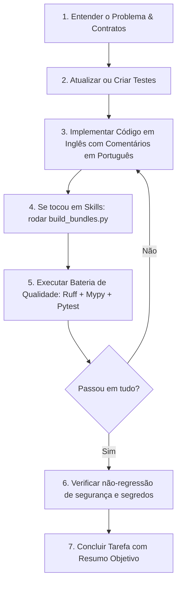

# AGENTS.md — Manual de Operação para Agentes de IA

Bem-vindo ao repositório do **ADO Team Compass** (`ado-team-compass`). Este documento define as regras operacionais, restrições arquiteturais, invariantes inegociáveis, convenções de código e comandos essenciais para qualquer agente autônomo ou assistente de IA atuando neste projeto.

---

## 1. Visão Geral do Projeto

O **ADO Team Compass** é uma ferramenta de visibilidade de entrega para equipes que usam o **Azure DevOps**. Ele transforma o board da sprint em relatórios auditáveis, reproduzíveis e prontos para a daily em segundos, eliminando planilhas manuais e cálculos ad-hoc.

### Pilares Fundamentais
1. **Auditoria e Reprodutibilidade:** Os mesmos fatos coletados + configuração + relógio explícito produzem exatamente as mesmas métricas numéricas, sem depender de alucinações de LLM.
2. **Exclusividade MCP Oficial:** Toda e qualquer comunicação com o Azure DevOps ocorre estritamente através do servidor oficial [microsoft/azure-devops-mcp](https://github.com/microsoft/azure-devops-mcp).
3. **Zero Credenciais:** O produto não aceita, não armazena e não manipula tokens ou PATs do Azure DevOps; a autenticação pertence à sessão MCP do host.
4. **Foco Coletivo e Não Punitivo:** Não calcula ranking de produtividade individual, não infere ociosidade arbitrária e não culpa colaboradores.
5. **Transparência de Lacunas:** Quando faltam dados no board (ex.: horas restantes ou mapeamento de estados), as métricas são explicitamente marcadas como parciais ou indisponíveis, com motivo auditável. Nunca se inventam zeros ou números fictícios.

---

## 2. Invariantes Inegociáveis e Regras de Segurança (Guardrails)

Todo agente deve obedecer estritamente aos seguintes guardrails arquiteturais:

> [!IMPORTANT]
> **MCP_ONLY:** É proibido qualquer canal de comunicação direta com o Azure DevOps.
> - **Proibido:** Fazer requisições REST/OData para `dev.azure.com` ou `visualstudio.com`.
> - **Proibido:** Importar ou usar SDKs do Azure DevOps (`azure-devops`, `azure-devops-python-api`).
> - **Proibido:** Invocar a CLI do Azure (`az boards`, `az devops`).
> - **Proibido:** Utilizar web scraping ou servidores MCP alternativos não oficiais.
> - **Verificação:** O teste de contrato `tests/contract/test_no_direct_ado_access.py` faz varredura estática no código-fonte e falha na presença desses padrões.

> [!WARNING]
> **READ_ONLY:** O escopo do projeto é estritamente de leitura.
> - O Compass nunca cria, edita, move, exclui ou comenta itens de trabalho no Azure DevOps.
> - Ações recomendadas pelo assistente são exportadas localmente para revisão humana e nunca gravadas diretamente no board.

> [!CAUTION]
> **ZERO_SECRETS:** Proteção contra vazamento de credenciais.
> - Nunca comite, persista ou registre em logs valores com padrão de PATs, JWTs, senhas, tokens GitHub ou cookies.
> - Parâmetros e dicionários de erro devem ser sanitizados via `sanitize_detail()` de `ado_team_compass.errors`.
> - O teste `tests/integration/test_secret_scan.py` valida que nenhum manifesto, evidência ou log expõe dados sensíveis.

> [!NOTE]
> **DETERMINISMO E PUREZA DE CÁLCULO:**
> - Funções de domínio em `src/ado_team_compass/metrics/` devem ser funções puras: recebem fatos normalizados, configuração resolvida e relógio explícito (`as_of: datetime`).
> - Nenhuma função de cálculo pode acessar rede, relógio do sistema (`datetime.now()`) ou modelo de linguagem (LLM).
> - Conteúdo vindo do Azure DevOps (títulos, descrições, tags) é tratado como **dado não-confiável** (untrusted content); nunca deve ser injetado como instrução no assistente.

---

## 3. Diretrizes de Idioma e Padrões de Código

Seguindo as convenções do projeto e as regras globais do usuário:

| Elemento | Idioma Obrigatório | Exemplos / Convenções |
|---|---|---|
| **Código-Fonte** | Inglês | Variáveis, funções, classes, métodos, atributos, nomes de arquivos Python. |
| **Comentários de Código** | Português | Docstrings e comentários inline explicando a intenção e regras de negócio. |
| **Documentação Técnica** | Português | Arquivos Markdown (`README.md`, `AGENTS.md`, `docs/*.md`). |
| **Planos e Tarefas** | Português | Planos de implementação, listas de verificação, issues e PRs. |
| **Mensagens de Erro / Diagnóstico** | Português | Mensagens legíveis para o usuário em `errors.py` e CLI. |

### Padrões Técnicos
- **Python:** 3.12 ou superior (`requires-python = ">=3.12"`).
- **Tipagem Estrita:** Código 100% tipado, validado por `mypy` no modo estrito (`strict = true`, plugin `pydantic.mypy`). Não utilize `Any` sem justificativa prévia e nunca ignore erros de tipagem com `# type: ignore` generalizado.
- **Modelos de Dados:** Pydantic v2 para contratos, validações e schemas JSON.
- **Estilo e Formatação:** Ruff configurado com comprimento de linha de 100 caracteres (`line-length = 100`) e conjunto estrito de regras (`E`, `F`, `I`, `UP`, `B`, `SIM`, `RUF`, `ANN`, `PTH`).

---

## 4. Mapa da Estrutura do Repositório

```
ado-team-compass/
├── src/ado_team_compass/       # Pacote principal da aplicação
│   ├── cli.py                  # Ponto de entrada CLI (subcomandos: demo, doctor, status, etc.)
│   ├── pipeline.py             # Orquestrador de fluxo completo (coleta -> métricas -> persistência -> relatório)
│   ├── diagnostics.py          # Verificador de ambiente e conectividade (doctor)
│   ├── errors.py               # Hierarquia CompassError, códigos de saída e sanitização
│   ├── contracts/              # Modelos Pydantic (config, fatos, métricas, execuções, manifestos)
│   ├── mcp/                    # Cliente MCP oficial, descoberta de ferramentas e allowlist de ações
│   ├── adapters/               # Adaptadores de protocolo MCP e transportes
│   ├── collect/                # Coletores de dados (projetos, equipes, capacidades, itens via lote)
│   ├── metrics/                # Motor de cálculo determinístico de métricas de sprint e alocação
│   ├── config/                 # Resolução hierárquica de configuração e validação de perfis
│   ├── profiles/               # Perfis declarativos em YAML (sprint-horas, sprint-sem-horas, fluxo-continuo)
│   ├── reporting/              # Renderizadores Markdown, JSON e HTML (templates Jinja2 autocontidos)
│   ├── runs/                   # Armazenamento imutável de execuções com hashes SHA-256 (RunStore)
│   ├── decisions/              # Registro e auditoria de anotações humanas e decisões
│   ├── gateway/                # Servidor FastAPI opcional para consulta segura de relatórios (leitura)
│   └── demo/                   # Dados sintéticos mockados para execução 100% offline
├── integrations/shared/        # Fonte ÚNICA de instruções e skills para assistentes de IA
│   ├── hosts.yaml              # Metadados e variáveis suportadas por assistente
│   └── skills/                 # Arquivos markdown de skills compartilhadas (atc-status, atc-allocation, etc.)
├── plugin/                     # BUNDLES GERADOS para cada assistente (NÃO EDITAR DIRETAMENTE)
│   ├── antigravity/            # Bundle do Google Antigravity
│   ├── claude/                 # Bundle do Claude Code
│   └── codex/                  # Bundle do OpenAI Codex
├── packaging/                  # Scripts de automação de pacotes e validação de bundles
│   ├── build_bundles.py        # Compila skills de integrations/shared para plugin/*
│   └── package_bundles.py      # Empacota bundles em zips com wheels
├── docs/                       # Especificações e contratos de arquitetura
├── tests/                      # Suíte de testes automatizados
│   ├── unit/                   # Testes unitários puros sem I/O
│   ├── contract/               # Testes de contrato de ferramentas MCP e proibição de canais diretos
│   ├── integration/            # Testes de ponta a ponta, gateway e varredura de segredos
│   ├── evals/                  # Validações de narrativa gerada
│   ├── install/                # Testes de empacotamento e integridade dos bundles
│   └── backtesting/            # Testes com histórico e cenários passados
├── pyproject.toml              # Metadados do projeto, dependências e configurações de ferramentas
└── uv.lock                     # Lockfile determinístico de dependências
```

---

## 5. Comandos Operacionais (Runbook do Agente)

Todos os comandos devem ser executados no ambiente virtual através do `uv`:

### Instalação e Sincronização
```bash
# Sincroniza o ambiente travado com dependências de desenvolvimento e API
uv sync --group dev --extra api --frozen
```

### Verificação de Qualidade e Conformidade
```bash
# 1. Análise estática e linter
uv run ruff check .

# 2. Correção automática de linter (quando aplicável)
uv run ruff check --fix .

# 3. Verificação de formatação de código
uv run ruff format --check .

# 4. Formatação automática de código
uv run ruff format .

# 5. Verificação estrita de tipos
uv run mypy

# 6. Verificação de consistência dos bundles de skills
uv run python packaging/build_bundles.py --check
```

### Execução de Testes
```bash
# Executa a suíte de testes completa (determinística, sem rede/ADO real)
uv run pytest -m "not integration"

# Executa testes de uma pasta específica (ex.: unitários)
uv run pytest tests/unit/

# Executa teste com cobertura
uv run pytest --cov=ado_team_compass tests/unit/

# Testes de integração (somente quando uma sessão real do MCP estiver ativa)
uv run pytest -m "integration"
```

### Demonstração e Execução Local
```bash
# Verifica a versão instalada
uv run ado-team-compass version

# Executa diagnóstico local
uv run ado-team-compass doctor

# Gera relatório de demonstração em HTML (offline, sem ADO)
uv run ado-team-compass demo --format html --output /tmp/relatorio-demo.html

# Gera relatório de demonstração em Markdown no terminal
uv run ado-team-compass demo --format markdown
```

### Construção de Pacotes e Bundles
```bash
# Regenera os bundles em plugin/ a partir de integrations/shared/
uv run python packaging/build_bundles.py

# Constrói o wheel (.whl) e o source distribution (.tar.gz)
uv build
```

---

## 6. Protocolo de Modificação e Entrega para Agentes

Ao receber uma tarefa de implementação, refatoração ou correção de bug, siga este passo a passo obrigatório:



### Checklist Obrigatório antes de Concluir qualquer Tarefa:
- [ ] O código respeita a regra `MCP_ONLY` (nenhum acesso HTTP/REST direto ao Azure DevOps)?
- [ ] Nenhuma credencial ou token foi incluído em arquivos, testes ou fixtures?
- [ ] O código está escrito em inglês e os comentários explicativos em português?
- [ ] A documentação ou mensagem para o usuário está em português?
- [ ] Se arquivos em `integrations/shared/skills/` foram alterados, os bundles foram sincronizados via `uv run python packaging/build_bundles.py`?
- [ ] `uv run ruff check .` não acusa erros?
- [ ] `uv run ruff format --check .` passa sem alterações pendentes?
- [ ] `uv run mypy` conclui com sucesso (0 erros em modo strict)?
- [ ] `uv run pytest -m "not integration"` passa com 100% de sucesso?

---

## 7. Convenções de Erros e Códigos de Saída

O ADO Team Compass padroniza seus erros operacionais através da classe base `CompassError` em `ado_team_compass.errors`:

| Código de Saída (`ExitCode`) | Valor | Significado | Exemplo de Cenário |
|---|---|---|---|
| `OK` | 0 | Sucesso | Relatório gerado com sucesso. |
| `INVALID_INPUT` | 2 | Argumentos ou configuração inválidos | Opção de CLI inexistente ou YAML corrompido. |
| `ACCESS_DENIED` | 3 | Falha de autenticação/sessão MCP | Sessão MCP expirada ou sem permissão de leitura. |
| `COLLECT_FAILED` | 4 | Falha na coleta de dados do MCP | Ferramenta MCP necessária não encontrada ou timeout. |
| `PARTIAL_CAPABILITY` | 5 | Dados insuficientes para cálculo completo | Ausência de estimativas em itens ou falta de horas da equipe. |
| `SCHEMA_INCOMPATIBLE` | 6 | Incompatibilidade de versão de schema | Arquivo de run persistido com versão de schema legada. |

### Regra de Ouro para Lacunas de Dados
Se o board do Azure DevOps não possuir estimativas ou calendários de equipe, **NUNCA** complete os dados com zero artificial. Registre uma `PartialMetric` explicando detalhadamente qual informação está ausente no Azure DevOps para que o relatório aponte com clareza o motivo da restrição.
