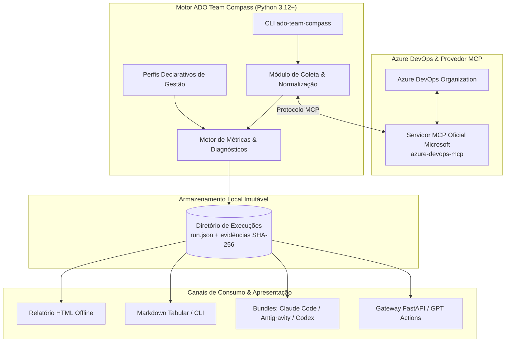

# ADO Team Compass
> Motor analítico e distribuível para visibilidade de entrega e capacidade no Azure DevOps com cálculos auditáveis, operando exclusivamente via Model Context Protocol (MCP) oficial da Microsoft.

[](https://github.com/LuisCarlosLopes/ado-team-compass/actions/workflows/ci.yml)
[](pyproject.toml)
[](https://github.com/astral-sh/uv)
[](https://github.com/microsoft/azure-devops-mcp)
[](pyproject.toml)
[](pyproject.toml)
[](LICENSE)

## 📌 Visão Geral

O **ADO Team Compass** soluciona a fragmentação de visibilidade e a ausência de previsibilidade confiável em fluxos de entrega gerenciados no Azure DevOps. Tradicionalmente, equipes de engenharia e lideranças técnicas enfrentam relatórios opacos, agregações manuais e ferramentas que dependem de tokens dispersos ou de chamadas REST desestruturadas. O projeto estabelece uma camada analítica que separa de forma estrita a extração de fatos brutos, a execução de cálculos matemáticos auditáveis e a interpretação orientada a evidências.

A aplicação adota como premissa mandatória o consumo de dados do Azure DevOps **exclusivamente através do servidor oficial Model Context Protocol (MCP) da Microsoft** (`microsoft/azure-devops-mcp`). Toda a coleta é determinística e imutável, preservando rastreabilidade criptográfica (SHA-256) dos fatos e evidências locais. O motor produz relatórios em HTML autossuficientes e offline, tabelas em Markdown e dados estruturados em JSON, alimentando tanto execuções automatizadas em pipelines de CI/CD quanto assistentes de IA (Claude Code, Google Antigravity, OpenAI Codex e ChatGPT Actions).



## 🚀 Funcionalidades

- **Canal de Acesso Exclusivo via MCP Oficial:** Interação estrita com o Azure DevOps por meio do servidor oficial da Microsoft, sem chamadas diretas a APIs REST, Analytics/OData, SDKs proprietários ou scraping.
- **Cálculos Determinísticos e Auditabilidade:** Total separação entre apuração de métricas e síntese contextual; cada indicador aponta diretamente para o identificador e hash da evidência JSON persistida.
- **Configuração Declarativa por Perfis:** Adaptação precisa a diferentes dinâmicas de entrega (ex.: `sprint_with_capacity` e `continuous_flow`), suportando parametrizações customizadas de estados, impedimentos e calendários (`tzdata`).
- **Análise de Carga e Capacidade Sem Rankeamento Individual:** Visibilidade clara de carga restante e disponibilidade de equipe, mitigando sobrecargas e gargalos sem gerar métricas de ranqueamento individual de desenvolvedores.
- **Detecção Antecipada de Impedimentos:** Mapeamento automático de bloqueios operacionais, inconsistências de fluxo e work items em estados não catalogados.
- **Relatórios Operacionais Ricos:** Geração de relatórios em HTML autocontido (interativo e offline), Markdown estruturado para visualização em terminal e JSON serializado.
- **Simulação Sintética (Modo Demo) e Replay:** Execução demonstrativa autocontida (`demo`) sem necessidade de credenciais ou rede, permitindo também recalcular métricas sobre dados congelados (`replay`).
- **Automação Idempotente:** Comando `run-scheduled` com detecção de reexecuções redundantes e mecanismo de lock para pipelines de automação (GitHub Actions e Azure Pipelines).
- **Gateway REST de Leitura para GPT Actions:** Serviço FastAPI integrado (`ado-team-compass[api]`) com autenticação JWT/OIDC e controle granular de permissões via ACL para consumo em assistentes remotos.
- **Distribuição Multi-Assistente:** Gerador de artefatos e bundles sincronizados para integração local no Claude Code, Google Antigravity IDE e OpenAI Codex.

## 📋 Pré-requisitos

- **Python:** Versão `>= 3.12` (testado e homologado para Python 3.12 e 3.13).
- **Gerenciador de Dependências:** [`uv`](https://github.com/astral-sh/uv) `>= 0.5.0` (recomendado) ou Python `venv` + `pip`.
- **Node.js (Opcional):** `>= 18 LTS` (necessário exclusivamente caso execute o servidor MCP oficial em modo local `stdio` via `npx`).
- **Sistema Operacional:** macOS, Linux ou Windows.

## ⚙️ Instalação e Configuração

### 1. Clonagem do repositório e navegação

```bash
git clone https://github.com/LuisCarlosLopes/ado-team-compass.git
cd ado-team-compass
```

### 2. Configuração de ambiente

Crie a estrutura de diretórios do projeto e copie os arquivos de exemplo para parametrização:

```bash
mkdir -p .ado-team-compass/runs
cp examples/config/config.yaml .ado-team-compass/config.yaml
cp examples/config/config.local.example.yaml .ado-team-compass/config.local.yaml
```

Edite `.ado-team-compass/config.yaml` com as referências da sua organização, projetos e times do Azure DevOps. Caso pretenda utilizar o Gateway de leitura para GPT Actions, configure as variáveis de ambiente necessárias:

```bash
export COMPASS_RUNS_DIR=".ado-team-compass/runs"
export COMPASS_CONFIG_FILE=".ado-team-compass/config.yaml"
# Opcionais para execução do gateway HTTP:
export COMPASS_ACL_FILE="automation/gateway/acl.json"
export COMPASS_OIDC_ISSUER="https://login.microsoftonline.com/<tenant-id>/v2.0"
export COMPASS_OIDC_AUDIENCE="api://ado-team-compass"
export COMPASS_OIDC_JWKS_URL="https://login.microsoftonline.com/<tenant-id>/discovery/v2.0/keys"
```

### 3. Instalação de dependências e restauração de pacotes

Utilize o `uv` para sincronizar o ambiente virtual travado com todas as dependências de desenvolvimento e o extra de API:

```bash
uv sync --group dev --extra api
```

*(Alternativa sem uv)*:
```bash
python3 -m venv .venv
source .venv/bin/activate
pip install -e ".[api]"
pip install pytest pytest-cov ruff mypy types-PyYAML httpx
```

### 4. Build preliminar e verificação de artefatos

Gere o pacote distribuível (`wheel` e `sdist`) e valide a sincronização dos bundles:

```bash
uv run python packaging/build_bundles.py --check
uv build
```

## 💻 Como Usar

### Modo Demonstração (Sem credencial e sem conexão externa)

Execute o comando `demo` para validar a instalação e inspecionar os cálculos sobre dados sintéticos:

```bash
# Exibir o relatório formatado em Markdown diretamente no terminal
uv run ado-team-compass demo --format markdown

# Gerar o relatório operacional em HTML offline no diretório de saída
uv run ado-team-compass demo --format html --output .ado-team-compass/runs/demo-report.html
```

### Operação com Dados Reais do Azure DevOps

Certifique-se de que a sessão do servidor MCP oficial da Microsoft esteja ativa e autenticada.

1. **Diagnóstico do ambiente e capacidades:**
   ```bash
   uv run ado-team-compass doctor
   ```

2. **Descoberta inicial e mapeamento de perfis:**
   ```bash
   uv run ado-team-compass setup --organization sua-organizacao
   ```

3. **Coleta e emissão de relatório da equipe:**
   ```bash
   uv run ado-team-compass status --team plataforma --format markdown
   ```

4. **Visualização analítica de carga e alocação:**
   ```bash
   uv run ado-team-compass allocation --team plataforma
   ```

5. **Inspeção de evidência específica:**
   ```bash
   uv run ado-team-compass evidence --run 20260915T120000-demo --reference 108
   ```

6. **Execução agendada idempotente (Pipelines/Cron):**
   ```bash
   uv run ado-team-compass run-scheduled --team plataforma --non-interactive
   ```

### Execução do Gateway de Leitura para GPT Actions

Inicie o servidor HTTP com FastAPI e Uvicorn para atender requisições remotas autenticadas:

```bash
uv run uvicorn "ado_team_compass.gateway.factory:application" --host 0.0.0.0 --port 8080
```

Exemplo de chamada com cURL para validar a integridade da API:

```bash
# Verificação de integridade (Healthcheck público)
curl -s http://127.0.0.1:8080/healthz

# Consulta autorizada ao relatório mais recente de uma equipe
curl -s -X GET http://127.0.0.1:8080/v1/teams/plataforma/report \
  -H "Authorization: Bearer <seu-token-jwt>" \
  -H "Accept: application/json"
```

## 🧪 Testes

O repositório possui uma suíte rigorosa de testes unitários, validações contratuais e checagem de tipos em conformidade com as diretrizes de CI.

```bash
# Executar a suíte de testes determinísticos (sem dependência de rede ou credenciais)
uv run pytest -m "not integration"

# Executar testes com relatório de cobertura de código
uv run pytest --cov=ado_team_compass tests/

# Executar testes de integração reais (requer acesso e sessão ativa no Azure DevOps)
uv run pytest -m "integration"

# Verificação de qualidade de código e estilo (linter)
uv run ruff check .

# Validação de formatação
uv run ruff format --check .

# Verificação estática de tipos (modo estrito)
uv run mypy
```

## 🤝 Contribuição

Contribuições para o projeto devem observar os seguintes padrões de engenharia:

1. **Branches:** Crie branches temáticas a partir da `main` utilizando nomenclaturas semânticas:
   - `feature/nome-da-funcionalidade`
   - `fix/descricao-da-correcao`
   - `chore/tarefa-ou-melhoria`
2. **Padrão de Commits:** Adote a convenção de [Conventional Commits](https://www.conventionalcommits.org/) (ex.: `feat(metrics): add flow efficiency calculation`, `fix(mcp): sanitize query arguments`).
3. **Qualidade Obrigatória:** Antes de abrir um Pull Request, execute localmente a suíte de verificação:
   ```bash
   uv run ruff check .
   uv run ruff format --check .
   uv run mypy
   uv run python packaging/build_bundles.py --check
   uv run pytest -m "not integration"
   ```
4. **Pull Requests:** Submeta o PR detalhando o contexto, a motivação técnica, as evidências de teste e os impactos em compatibilidade.

## 📄 Licença

Este projeto é protegido sob os termos de licença proprietária de seu autor. Para mais detalhes, consulte o arquivo [LICENSE](LICENSE).
