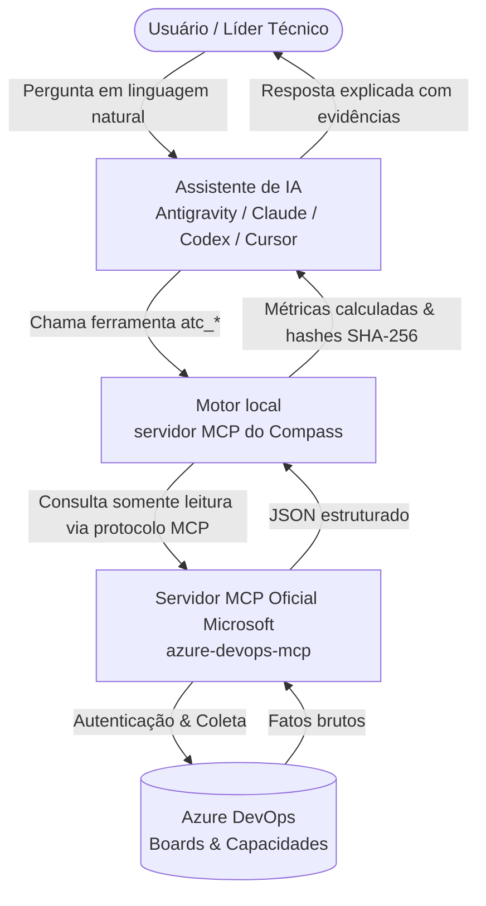

# Guia de Introdução (Get Started) do Plugin e Catálogo de Skills

> Como instalar, configurar e utilizar o **ADO Team Compass** integrado ao seu assistente de IA preferido (Google Antigravity, Claude Code, OpenAI Codex ou Cursor), com exemplos práticos para cada uma das 8 skills disponíveis.

---

## 1. Visão Geral e Arquitetura

O **ADO Team Compass** foi projetado para transformar o board do Azure DevOps em relatórios de sprint auditáveis, determinísticos e prontos para a tomada de decisão em segundos. Quando utilizado como **plugin de assistente de IA**, ele capacita seu modelo de linguagem a consultar o estado real do projeto sem alucinações numéricas e sem comprometer a segurança da organização.

### Como a Integração Funciona

O assistente de IA não calcula métricas nem acessa o Azure DevOps por conta própria. O fluxo de responsabilidades é rigorosamente delimitado em quatro camadas:



### Pilares de Segurança e Confiabilidade
1. **Exclusividade MCP Oficial (`MCP_ONLY`):** O Compass nunca faz requisições REST/OData diretas para `dev.azure.com`, não usa SDKs e não faz web scraping. Toda a comunicação ocorre estritamente pelo servidor oficial da Microsoft ([microsoft/azure-devops-mcp](https://github.com/microsoft/azure-devops-mcp)).
2. **Zero Credenciais (`ZERO_SECRETS`):** O produto nunca pede senha nem PAT, e nenhum valor de credencial entra na configuração do Compass, nos artefatos de execução ou em log. No transporte stdio, a credencial pertence ao ambiente da configuração de MCP do host, lido na conexão por referência. No transporte remoto, a autorização é concedida pelo provedor de identidade da organização, no navegador, e o material resultante fica isolado em `~/.ado-team-compass/auth` com permissão restrita ao dono.
3. **Estritamente Leitura (`READ_ONLY`):** O Compass nunca altera o estado de work items, nunca move cards, nunca apaga dados e nunca comenta no Azure DevOps.
4. **Cálculo Determinístico e Puro:** Todas as fórmulas e totais vêm do motor Python puro, sem intervenção criativa de LLMs. Se faltarem estimativas ou dados no board, o Compass aponta a lacuna como `partial` ou `unavailable` — nunca inventa zeros ou números hipotéticos.
5. **Foco Coletivo e Não Punitivo:** A ferramenta não calcula rankings individuais, não julga produtividade e não deduz ociosidade de colaboradores.

---

## 2. Pré-requisitos de Instalação

1. **Python 3.11 ou superior** no sistema (macOS, Linux ou Windows):
   ```bash
   python3 --version
   ```
   O motor é Python e uma de suas dependências tem código compilado, então não há como
   dispensar o interpretador. Se o `python3` do seu sistema for anterior a 3.11 — no macOS
   ainda é 3.9 — o launcher procura sozinho um `python3.11` a `python3.14` no PATH. Para fixar um interpretador específico, aponte `ADO_TEAM_COMPASS_ENGINE_PYTHON`
   para ele.

2. **Servidor MCP Oficial do Azure DevOps ativo no host de IA:** siga as orientações do
   repositório oficial [microsoft/azure-devops-mcp](https://github.com/microsoft/azure-devops-mcp)
   para autenticar a sua organização no host correspondente.

Não é preciso instalar a CLI antes. O bundle de release traz o motor em `engine/` e o prepara
na primeira execução, em um ambiente isolado sob `~/.ado-team-compass/runtime`. Se o pacote
`ado-team-compass` já estiver instalado na máquina, é essa instalação que o bundle reaproveita.

Para desabilitar a preparação automática — em ambiente sem rede ou com instalação controlada —
defina `ADO_TEAM_COMPASS_NO_BOOTSTRAP=1` e instale o motor você mesmo:

```bash
python3 -m pip install engine/ado_team_compass-<versao>-py3-none-any.whl
```

---

## 3. Instalação do Plugin por Assistente de IA

O repositório gera pacotes especializados e autocontidos para cada assistente suportado na
pasta `plugin/<host>/` (ou nos zips de release correspondentes). Todo bundle traz
`bin/atc-mcp.py`, o launcher que sobe o servidor MCP do motor.

### 3.1. Claude Code
O manifesto `.claude-plugin/plugin.json` declara o servidor, então não há registro manual:

```bash
claude plugin add ./plugin/claude
```

O Claude Code sobe `ado-team-compass` junto com o plugin, usando `${CLAUDE_PLUGIN_ROOT}` para
achar o launcher. Configure à parte o servidor MCP oficial da Microsoft:

```bash
claude mcp add azure-devops <comando-ou-url-do-servidor-oficial>
```

O hook opcional em `plugin/claude/hooks/session_notice.py` avisa quando o último relatório
persistido está desatualizado, sem executar nenhuma chamada de rede.

### 3.2. Google Antigravity, OpenAI Codex e Cursor
Estes hosts não expõem uma variável com a raiz do bundle, então a declaração do servidor não é
gerada — o caminho precisa ser absoluto e só você o conhece. Cada bundle traz um
`mcp-server.json` pronto para copiar:

```json
{
  "mcpServers": {
    "ado-team-compass": {
      "args": ["/caminho/absoluto/do/bundle/bin/atc-mcp.py"],
      "command": "python3"
    }
  }
}
```

1. Instale o bundle do seu host (`plugin/antigravity/`, `plugin/codex/` ou `plugin/cursor/`)
   conforme o procedimento dele.
2. Copie a entrada acima para a configuração de MCP do host, trocando o caminho pelo diretório
   real do bundle instalado. No Cursor, esse arquivo é o `.cursor/mcp.json` do projeto.
3. Configure também o servidor MCP oficial do Azure DevOps no mesmo host.

No Cursor, você pode reaproveitar a sessão oficial já configurada informando `from_mcp_config`
ao chamar `atc_setup`, em vez de digitar a organização de novo.

---

## 4. Primeiros Passos e Verificação Inicial (Smoke Test)

Depois de instalar o bundle, valide o ambiente em três passos, conversando com o assistente.
A primeira chamada pode demorar alguns segundos: é o motor sendo preparado uma única vez.

### Etapa 1: Teste Offline sem Credenciais (`atc_demo`)
> *"Faça uma demonstração do relatório do Compass para eu ver o formato."*

O assistente chama `atc_demo` e devolve o relatório completo com dados sintéticos, sem rede e
sem credencial. Para o HTML navegável, peça o relatório em HTML: o assistente chama
`atc_render` e informa o caminho do arquivo gravado.

### Etapa 2: Diagnóstico do Ambiente e Conexão (`atc_doctor`)
> *"O Compass está conectado e configurado corretamente?"*

O assistente chama `atc_doctor` e relata versão do motor, validade da configuração, canal e
versão do servidor MCP, hash do catálogo e operações indisponíveis. Se a resposta trouxer
`exit_code: 3`, renove a autenticação no servidor MCP oficial da Microsoft no seu host.

### Etapa 3: Descoberta e Configuração da Organização (`atc_setup`)
> *"Configure o ADO Team Compass para a organização 'minha-empresa'."*

O assistente chama `atc_setup` e grava `.ado-team-compass/config.yaml` no diretório de
trabalho, sem nenhuma credencial.

Após o setup, abra `.ado-team-compass/config.yaml` para ajustar o perfil de cada equipe descoberta:
- `sprint_with_capacity`: Times Scrum que usam estimativas de horas restantes e capacidade de membros.
- `sprint_without_hours`: Times que operam por contagem de itens ou pontos, sem horas individuais.
- `continuous_flow`: Times Kanban ou de sustentação com fluxo contínuo.

---

## 4.1. Como o Compass alcança o Azure DevOps

> [!IMPORTANT]
> **O Compass não herda a sessão de MCP do seu assistente.** Ter o servidor oficial
> configurado no host não basta: o motor é um cliente MCP independente e abre a própria
> conexão, a partir de `.ado-team-compass/config.yaml`. É por isso que `atc_setup` existe.

Há dois transportes, e o que você precisa ter instalado muda entre eles.

### Transporte stdio — reaproveita o que o host já tem (recomendado)

O Compass **sobe o processo do servidor oficial da Microsoft ele mesmo**, então o pacote
`@azure-devops/mcp` precisa estar disponível na máquina — na prática, Node e `npx`.

Chame `atc_setup` com `from_mcp_config` apontando para a configuração de MCP do host (e
`mcp_server`, se o servidor não se chamar `ado`). O que é copiado: comando, argumentos e uma
**referência** ao arquivo de onde o ambiente será lido na conexão. A credencial em si nunca
entra na configuração do Compass.

```bash
ado-team-compass setup --from-mcp-config .cursor/mcp.json --mcp-server ado
```

### Transporte remoto — nada a instalar, autorização explícita

`atc_setup` com `organization` aponta para o servidor remoto oficial
(`https://mcp.azuredevops.com/{organização}/mcp`). Não há nada para instalar, mas o acesso
precisa ser autorizado uma vez:

- Chame **`atc_login`**. O Compass abre o navegador, você autentica no provedor de identidade
  da sua organização e a autorização volta para um endereço em `127.0.0.1`. Nenhuma senha,
  PAT ou token é digitado no Compass ou visto por ele.
- O material fica em `~/.ado-team-compass/auth`, com permissão restrita ao dono, e é renovado
  sozinho enquanto valer. Nenhuma coleta abre navegador: se a autorização faltar, a resposta
  é `exit_code` 3 dizendo para chamar `atc_login`.
- **`atc_logout`** apaga o material local. A revogação da concessão acontece no provedor de
  identidade da organização, não aqui.

`atc_doctor` informa o estado da autorização no bloco `authorization`, sem expor nenhum valor.

---

## 5. Catálogo Completo das 8 Skills e Exemplos de Uso

O ADO Team Compass disponibiliza **8 skills especializadas**. Cada uma atende a uma intenção clara do ciclo de entrega.

---

### Skill 1: `atc-setup`

| Propriedade | Detalhe |
|---|---|
| **Identificador** | `atc-setup` |
| **Finalidade** | Descobre projetos e equipes disponíveis na organização através do MCP oficial e gera a configuração inicial local. |
| **Ferramenta MCP** | `atc_setup` com `organization` |
| **Quando usar** | Ao iniciar o uso do produto em uma nova organização ou após mudanças estruturais de equipes no Azure DevOps. |

#### Exemplo de Interação
- **Usuário:**
  > *"Por favor, configure o Compass para a organização 'contoso-corp'."*
- **Ação do Assistente:**
  Chama `atc_setup` com `organization: contoso-corp`.
- **Interpretação da Resposta:**
  O assistente apresenta a lista de equipes encontradas com seus identificadores e avisa que o arquivo `.ado-team-compass/config.yaml` foi gerado. Ele lembra você de revisar os perfis de trabalho (sprint com horas vs sem horas) e rodar o `doctor`.

#### Salvaguardas e Regras de Interpretação
- Nenhuma credencial é escrita no arquivo `.ado-team-compass/config.yaml`.
- O processo técnico descoberto (ex.: Agile, Scrum, CMMI) não define a prática de gestão por si só; a equipe deve confirmar seu perfil.

---

### Skill 2: `atc-doctor`

| Propriedade | Detalhe |
|---|---|
| **Identificador** | `atc-doctor` |
| **Finalidade** | Diagnostica a integridade do ambiente, validade do YAML, conectividade MCP e ferramentas disponíveis no catálogo. |
| **Ferramenta MCP** | `atc_doctor` (com `offline: true` para validar só o ambiente) |
| **Quando usar** | Sempre que uma consulta falhar, antes da daily ou para confirmar se a autenticação MCP continua ativa. |

#### Exemplo de Interação
- **Usuário:**
  > *"Verifique se a conexão do Compass com o Azure DevOps está funcionando."*
- **Ação do Assistente:**
  Chama `atc_doctor`.
- **Interpretação da Resposta:**
  ```text
  Versão do motor: 0.2.0
  Configuração: Válida (.ado-team-compass/config.yaml)
  Sessão MCP: Conectada (microsoft/azure-devops-mcp)
  Operações resolvidas: 7 disponíveis
  Operações indisponíveis: nenhuma
  ```

#### Salvaguardas e Regras de Interpretação
- **Saída 3 (`ACCESS_DENIED`):** Significa que a sessão MCP expirou ou não tem permissão de leitura. O assistente orientará você a reautenticar a sessão oficial do host, nunca solicitando PATs.
- **Saída 5 (`PARTIAL_CAPABILITY`):** Se alguma ferramenta opcional do catálogo estiver ausente (ex.: histórico de revisões), o assistente informa quais análises ficam restritas em vez de falhar silenciosamente.

---

### Skill 3: `atc-demo`

| Propriedade | Detalhe |
|---|---|
| **Identificador** | `atc-demo` |
| **Finalidade** | Executa uma rodada sintética 100% offline, gerando todos os artefatos de uma análise real para demonstração ou homologação. |
| **Ferramenta MCP** | `atc_demo` com `format: markdown` |
| **Quando usar** | Para apresentar a ferramenta a colegas, validar uma instalação recente ou entender a estrutura do relatório. |

#### Exemplo de Interação
- **Usuário:**
  > *"Como é a cara do relatório de sprint do Compass? Mostre uma demonstração."*
- **Ação do Assistente:**
  Chama `atc_demo` com `format: markdown`.
- **Interpretação da Resposta:**
  O assistente gera a tabela demonstrativa completa: trabalho restante conhecido, reserva de capacidade, impedimentos simulados e pontos de atenção. Ele ressalta explicitamente que os números são fictícios e auditáveis.

---

### Skill 4: `atc-status`

| Propriedade | Detalhe |
|---|---|
| **Identificador** | `atc-status` |
| **Finalidade** | Coleta os dados mais recentes do board da equipe e apresenta a situação da sprint: itens abertos, carga conhecida, capacidade restante, gap e impedimentos. |
| **Ferramenta MCP** | `atc_status` com `team` e `format` |
| **Quando usar** | Preparação da Daily Scrum, alinhamento de início do dia ou quando perguntarem "como está a sprint?". |

#### Exemplo de Interação
- **Usuário:**
  > *"Como está a sprint da equipe plataforma hoje? O que precisamos priorizar na daily?"*
- **Ação do Assistente:**
  Chama `atc_status` com `team: plataforma` e `format: markdown`.
- **Interpretação da Resposta:**
  O assistente destaca três blocos prioritários:
  1. **Veredito de Capacidade:** Ex.: 62 h de trabalho restante conhecido contra 50 h de capacidade reservada (sobrecarga conhecida de 12 h).
  2. **Impedimentos Ativos:** Lista os itens marcados como bloqueados no board com seus respectivos IDs.
  3. **Itens sem Estimativa:** Aponta se existem histórias ou tarefas sem valor preenchido (ex.: "3 itens sem estimativa de horas").
  4. **Ações Candidatas:** Recomenda confirmar dependências do item bloqueado e dimensionar os itens sem estimativa antes de tomar decisões de escopo.

#### Salvaguardas e Regras de Interpretação
- Unidades nunca são misturadas: horas são horas, pontos são pontos, contagem de itens é contagem de itens.
- Utilização calculada sobre dados parciais **não** prova carga baixa. Por outro lado, sobrecarga demonstrada pela carga conhecida pode ser citada como limite inferior absoluto.

---

### Skill 5: `atc-allocation`

| Propriedade | Detalhe |
|---|---|
| **Identificador** | `atc-allocation` |
| **Finalidade** | Detalha a carga conhecida e a capacidade restante reservada por pessoa da equipe na execução atual. |
| **Ferramenta MCP** | `atc_allocation` com `team` |
| **Quando usar** | Para checar balanceamento de trabalho, verificar quem pode apoiar tarefas críticas ou planejar redistribuições de esforço. |

#### Exemplo de Interação
- **Usuário:**
  > *"A equipe mobile está com trabalho bem distribuído ou tem alguém sobrecarregado?"*
- **Ação do Assistente:**
  Chama `atc_allocation` com `team: mobile`.
- **Interpretação da Resposta:**
  Apresenta a tabela por membro:
  | Pessoa | Carga Conhecida | Capacidade Restante | Utilização | Classe | Itens sem Estimativa |
  |---|---|---|---|---|---|
  | Ana Silva | 28 h | 20 h | 140% | `SOBRECARGA` | 0 |
  | Carlos Dias | 8 h | 24 h | 33% | `DENTRO_DA_FAIXA` | 2 |
  | Não Atribuído | 12 h | — | — | `SEM_RESPONSAVEL` | 1 |

#### Salvaguardas e Regras de Interpretação
- **`DADOS_INSUFICIENTES`:** Se uma pessoa possui tarefas sem estimativa, nunca se conclui que ela está com carga baixa.
- **`SEM_CARGA_REGISTRADA`:** Não significa ociosidade! A pessoa pode estar em atividades não rastreadas no board ou com tarefas pendentes de refinamento.
- **Proibição de Julgamento Individual:** A tabela não é ranking de produtividade. Qualquer sugestão de redistribuição de tarefas é apresentada como uma **candidata a confirmação** (verificar competências, dependências e prioridades), sem prometer ganhos automáticos de prazo.

---

### Skill 6: `atc-planning`

| Propriedade | Detalhe |
|---|---|
| **Identificador** | `atc-planning` |
| **Finalidade** | Executa a verificação das regras de planejamento ativadas no perfil da equipe, apontando inconsistências e higiene de backlog. |
| **Ferramenta MCP** | `atc_planning` com `team` |
| **Quando usar** | Durante sessões de refinamento, pré-planning ou revisão semanal de higiene do board. |

#### Exemplo de Interação
- **Usuário:**
  > *"Temos itens inconsistentes ou problemas de higiene no backlog da equipe backend?"*
- **Ação do Assistente:**
  Chama `atc_planning` com `team: backend`.
- **Interpretação da Resposta:**
  O assistente lista os achados encontrados conforme as políticas habilitadas:
  - **Histórias sem Tarefas:** User Story #402 não possui tarefas filhas registradas.
  - **Estimativas Ausentes:** Tarefa #405 no estado *In Progress* sem campo *Remaining Work*.
  - **Prazos Vencidos:** Item #380 com *Target Date* anterior à data de hoje.

#### Salvaguardas e Regras de Interpretação
- Apenas regras **explicitamente habilitadas** no perfil da equipe produzem achados. Regras não configuradas não geram alertas.
- Cada achado é um ponto de atenção a ser validado com o time, nunca um erro punitivo atribuído a alguém. Não calcula "score de saúde" ou percentuais arbitrários.

---

### Skill 7: `atc-evidence`

| Propriedade | Detalhe |
|---|---|
| **Identificador** | `atc-evidence` |
| **Finalidade** | Recupera a evidência local e imutável de uma execução anterior para auditar números ou reexecutar cálculos com dados congelados (`replay`). |
| **Ferramenta MCP** | `atc_evidence` com `team` e `reference`; `atc_replay` com `team` |
| **Quando usar** | Quando alguém questionar a origem de um número ("de onde vieram essas 34 horas?") ou para auditar uma sprint passada. |

#### Exemplo de Interação
- **Usuário:**
  > *"De onde saíram as 16 horas calculadas para a tarefa 204 no relatório de ontem?"*
- **Ação do Assistente:**
  Chama `atc_evidence` com `team: plataforma` e `reference: 204`.
- **Interpretação da Resposta:**
  O assistente traz o excerto imutável gravado localmente naquela execução:
  - ID: 204
  - Título sanitizado: *"Configurar pipeline de homologação..."*
  - Estado: *Active*
  - Responsável: João Santos
  - *Remaining Work*: 16 h
  - Hash SHA-256 do artefato íntegro e validado.

#### Salvaguardas e Regras de Interpretação
- O `replay` recalcula as fórmulas com as entradas congeladas e deve retornar `identical: true`. Se retornar `false`, sinaliza mudança de versão ou configuração.
- O hash garante integridade do arquivo local, não autenticidade do Azure DevOps.
- A evidência persiste apenas excertos de títulos para auditoria, nunca descrições integrais que possam conter instruções acidentais ou dados confidenciais.

---

### Skill 8: `atc-history`

| Propriedade | Detalhe |
|---|---|
| **Identificador** | `atc-history` |
| **Finalidade** | Apresenta métricas de compromisso (say/do), carry-over, mudanças de escopo (entradas e saídas) e métricas de fluxo (throughput e cycle time). |
| **Ferramenta MCP** | `atc_history` com `team` e `format` |
| **Quando usar** | Preparação de Retrospectivas, Sprint Reviews e análise de previsibilidade da equipe. |

#### Exemplo de Interação
- **Usuário:**
  > *"Quanto do que planejamos na sprint passada foi realmente entregue? O escopo mudou muito?"*
- **Ação do Assistente:**
  Chama `atc_history` com `team: plataforma` e `format: markdown`.
- **Interpretação da Resposta:**
  O assistente decompõe os números com rigor:
  - **Taxa Say/Do:** 75% (3 de 4 itens comprometidos na baseline foram concluídos).
  - **Entradas de Escopo (+):** 2 novos itens adicionados após o corte da baseline.
  - **Saídas de Escopo (-):** 1 item removido da sprint durante a execução.
  - **Carry-over:** 1 item da baseline permaneceu aberto e transitou para a sprint seguinte.
  - **Cycle Time:** Percentil 85 (P85) de 4,2 dias corridos.

#### Salvaguardas e Regras de Interpretação
- **Say/Do:** Contabiliza estritamente os itens presentes no corte da baseline. Itens adicionados após o início da sprint não entram no numerador para não inflar artificialmente o compromisso.
- **Entradas e Saídas:** Jamais são mascaradas em um único saldo líquido. Adicionar 5 itens e remover 5 itens significa 10 alterações de escopo, não estabilidade zero.
- Variações históricas são fatos descritivos para aprendizado da equipe, nunca base para culpabilização ou comparação de velocidade entre equipes distintas.

---

## 6. Fluxos de Trabalho Típicos no Ciclo Ágil

Aqui está como orquestrar as skills nas cerimônias reais da sua equipe:

### Rotina 1: Daily Scrum em 3 Minutos
1. Antes ou no primeiro minuto da daily, peça ao assistente:
   > *"Resumo para a daily da equipe plataforma hoje."*
2. O assistente aciona `atc-status`.
3. Você compartilha ou lê em voz alta:
   - Quais impedimentos precisam de intervenção imediata da liderança.
   - Se a equipe está em ritmo sustentável ou em sobrecarga evidente.
   - Quais itens abertos precisam ter estimativas preenchidas antes do fechamento do dia.

### Rotina 2: Sprint Planning e Refinamento
1. Para validar se as histórias estão prontas para a sprint:
   > *"Verifique a higiene das histórias para o planning da equipe dados."*
   *(Aciona `atc-planning` para apontar critérios incompletos)*
2. Para verificar se o compromisso cabe na capacidade do time:
   > *"Como está a projeção de alocação da equipe dados?"*
   *(Aciona `atc-allocation` para checar gargalos em especialistas)*

### Rotina 3: Retrospectiva da Sprint
1. No encerramento da iteração:
   > *"Mostre o histórico de compromisso e entrega da última sprint da equipe mobile."*
   *(Aciona `atc-history`)*
2. Discuta com a equipe:
   - O say/do refletiu o planejamento inicial?
   - O volume de itens que entraram no meio da sprint impactou os compromissos originais?
   - O P85 do lead time/cycle time está dentro do esperado para os acordos de nível de serviço?

---

## 7. Resolução de Problemas (Troubleshooting) e Códigos de Erro

O ADO Team Compass opera com códigos de saída padronizados (`ExitCode`). Conhecer esses códigos ajuda a entender o comportamento do assistente:

| Código | Nome | Significado | O que fazer |
|---|---|---|---|
| `0` | `OK` | Execução concluída com sucesso e dados completos. | Nenhuma ação necessária. |
| `2` | `INVALID_INPUT` | Parâmetros de CLI inválidos, equipe inexistente ou YAML corrompido. | Verifique o nome/alias da equipe com `--team` ou ajuste o YAML. |
| `3` | `ACCESS_DENIED` | Falha de autenticação ou permissão na sessão MCP oficial. | Renove a sessão do servidor MCP oficial no seu host. **Não cole tokens no Compass.** |
| `4` | `COLLECT_FAILED` | Falha na coleta (timeout, recurso não encontrado no Azure DevOps). | Verifique se o board e as iterações existem e execute novamente. |
| `5` | `PARTIAL_CAPABILITY` | Execução gerou relatório, mas com **dados parciais** (lacunas no board). | **Não é erro de software.** O relatório indicará exatamente qual informação está ausente (ex.: item sem horas, folga de membro ausente). Complete os dados no board ou ajuste o mapeamento. |
| `6` | `SCHEMA_INCOMPATIBLE` | Divergência de versão do schema JSON ou incompatibilidade de dados. | Verifique se a versão do motor é a mesma que gravou os dados salvos. |

### Dúvidas Frequentes

**P: Por que o relatório gerou código de saída 5?**  
R: O Compass tem o compromisso de nunca preencher lacunas com números artificiais. Se alguém criou uma tarefa no Azure DevOps sem preencher o campo *Remaining Work*, ou se o calendário da equipe não tem dias úteis cadastrados, o Compass emite `PARTIAL_CAPABILITY` e lista a razão exata no relatório. O relatório continua válido e utilizável.

**P: Como abro o relatório visual completo para a diretoria ou stakeholders?**  
R: Você pode pedir ao assistente: *"Gere o relatório em HTML"*. O assistente chama `atc_render` e o motor gera um arquivo HTML autocontido, moderno, sem dependências externas de CDN e pronto para abrir em qualquer navegador offline.
